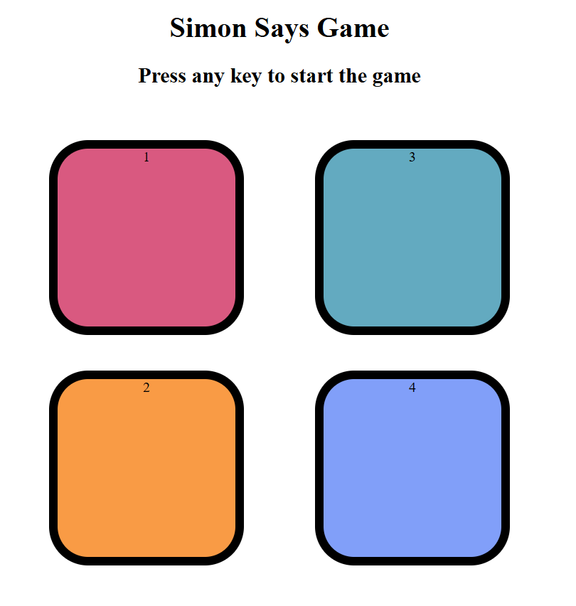
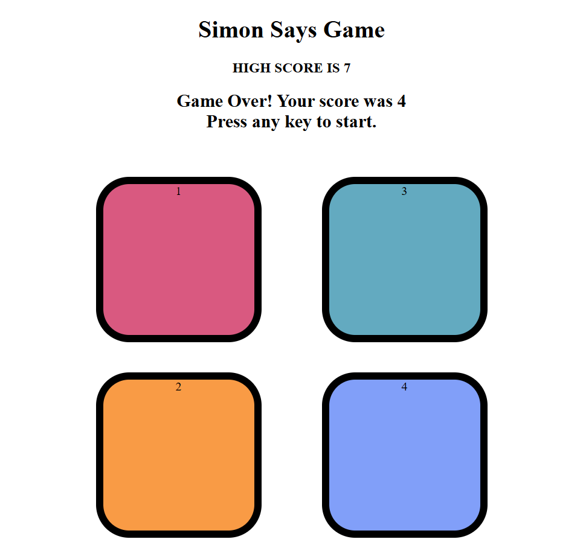

#  Simon Game

A fun and interactive memory-based game built using HTML, CSS, and JavaScript.
The game challenges users to remember and repeat an increasing sequence of colors.

---

##  How to Play

1. Press any key to start the game.
2. Watch the pattern of flashing colors.
3. Repeat the sequence by clicking the buttons in the same order.
4. With each level, the sequence increases.
5. Game ends if you click the wrong color.

---

##  Technologies Used

- HTML5
- CSS3
- JavaScript (DOM Manipulation)

---

##  Features

- Random color sequence generation
- Level progression system
- User input tracking
- Game over animation effect
- High score tracking

---

##  Project Structure

- index.html
- styles.css
- app.js
- README.md
- images/

---

##  Screenshot

---

##  Concepts Used

- Event Listeners
- Arrays & Functions
- DOM Manipulation
- setTimeout()
- Game Logic Implementation

---

##  Future Improvements

- Add sound effects 
- Add mobile responsiveness 
- Add restart button

---

##  Author

Nigaar Fatma